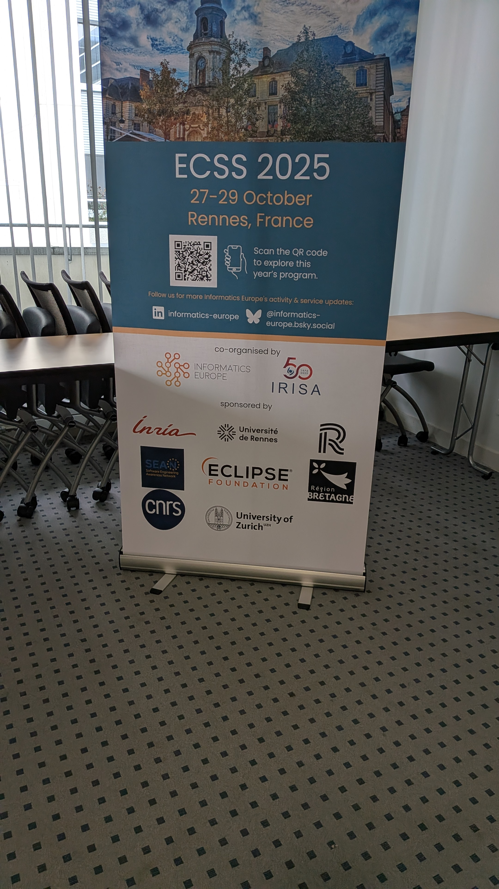

 will held its annual meeting <a href="https://www.informatics-europe.org/ecss/home.html">ECSS'25</a> in Rennes on October 27-29, 2025.

<!--more-->

The 2025 edition of the European Informatics Leaders Summit will be held from 27 to 29 October in Rennes, France, and will be co-hosted by Informatics Europe and our member institution, IRISA, as part of its 50th anniversary celebrations.

 and the European initiative lead by  will meet during this event.
 (and CNRS) has sponsored the event.

---
title: European Informatics Leaders Summit

event: ECSS'25
event_url: https://www.informatics-europe.org/ecss/home

location: Rennes, France
# address:
#   street: 450 Serra Mall
#   city: Stanford
#   region: CA
#   postcode: '94305'
#   country: United States

summary: The 2025 edition of the European Informatics Leaders Summit will be held from 27 to 29 October in Rennes, France, and will be co-hosted by Informatics Europe and our member institution, IRISA, as part of its 50th anniversary celebrations.

 and the European initiative lead by  will meet during this event.
abstract: 

# Talk start and end times.
#   End time can optionally be hidden by prefixing the line with `#`.
date: '2025-10-27T09:00:00Z'
date_end: '2025-10-29T17:00:00Z'
all_day: true

# Schedule page publish date (NOT talk date).
publishDate: '2025-07-08T00:00:00Z'

authors: [admin]
tags: []

# Is this a featured talk? (true/false)
featured: false

# image:
#   caption: 'Image credit: [**Unsplash**](https://unsplash.com/photos/bzdhc5b3Bxs)'
#   focal_point: Right

url_code: ''
url_pdf: 'programme.pdf'
url_slides: ''
url_video: ''

# Markdown Slides (optional).
#   Associate this talk with Markdown slides.
#   Simply enter your slide deck's filename without extension.
#   E.g. `slides = "example-slides"` references `content/slides/example-slides.md`.
#   Otherwise, set `slides = ""`.
slides:

# Projects (optional).
#   Associate this post with one or more of your projects.
#   Simply enter your project's folder or file name without extension.
#   E.g. `projects = ["internal-project"]` references `content/project/deep-learning/index.md`.
#   Otherwise, set `projects = []`.
projects:
---

